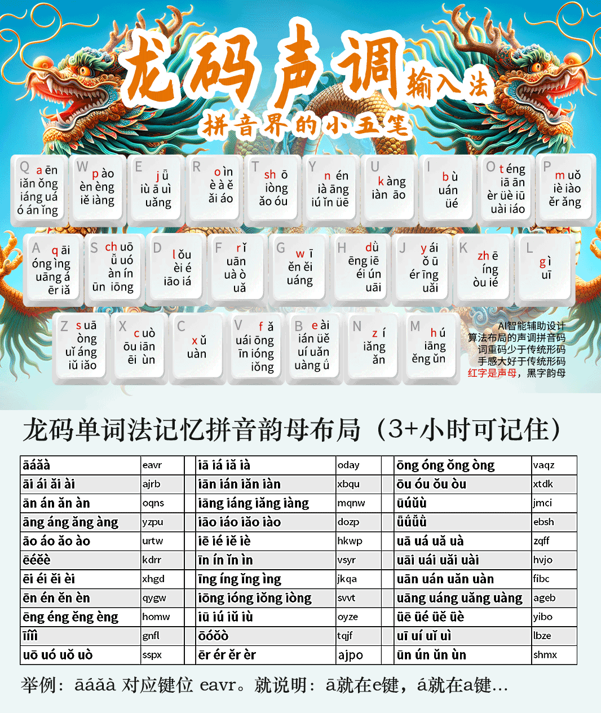

# ℞龍碼音調輸入法

原著者 晡時之光 [原始输入法页面见此](https://hanxinma.gitlab.io/longma)

本倉庫只根據現有 RIME 引擎公共元件，按照原輸入法定義進行複用以改善性能及可分離度，以此重新構建打包。

龍碼音調輸入法，將帶有音調的拼音拆分成聲母及韻母音調兩部分，分散於 26 鍵鍵盤上，每次輸入兩碼，以此提高輸入效率。

本方案僅使用原龍碼輸入法的音碼部分，未使用形碼輔助碼。

## 注意

該輸入法目前使用拼寫運算完成輸入，且大部分複用 RIME 本身架構中的公共元件，因此更新 [℞八股文](https://github.com/rime/rime-essay) 即同時更新詞庫。

本方案本身依赖 [℞地球拼音](https://github.com/rime/rime-terra-pinyin) 。

## 零聲母處理

與自然碼類似方式處理，即第一位重複韻母第一個字元，第二位為韻母及音調本身。

因為該輸入法輸入韻母時會同時輸入聲調，因此不存在第二位為自然碼同樣的韻母第二位的情況。

## 鍵盤佈局

新增按鍵見下：

| 拼音成份 | 按鍵（12345 聲） |
|--------|----------------|
| 輕聲 | 所有輕聲的按鍵與其第一聲相同 |
| ê (eh) | 所有按鍵與 e 相同 |
| 空韻母 h | MMMMM |
| 空韻母 m | PPPPP |
| 空韻母 n/ng | YYYYY |